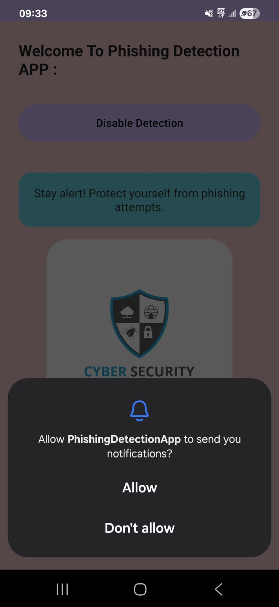

# SpamDetectionApplication
This Application is an extension to project name SpamDetection_Using_MachineLearning using Ngrok for hosting this local machine.

Android App Technologies
-
•Programming Language:
.Kotlin: Modern, concise language for Android development, enhancing code safety and readability.
<centre>

  

  

  
  

</centre>
Android SDK:
-
Essential for accessing Android's features, including notification management and1u
elements.

User Interface:
-
• Android XML Layouts: Declarative way to design the app's visual components (e.g., buttons,text views).
•Networking:
.Volley: Efficient and easy-to-use HTTP ibrary for making network requests to the Python backend.

Notification Mandling:
-
Android Notifications API: Used to display alerts to the user upon detection of potential
phishing.

NotificationListener Service: Core service for intercepting and processing incoming notifications from other apps.

Concurrency (Implicit):
-
Kotin Coroutines (yvia Volley): Handles background network operations without blocking the main Ul thread, ensuring a smooth user experience.

<h1> To SetUp the application Read the setup file in appFiles</h1>
